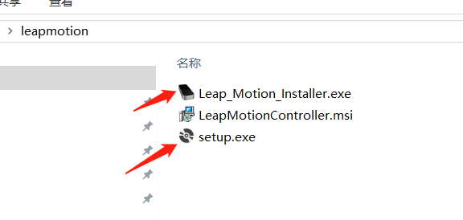
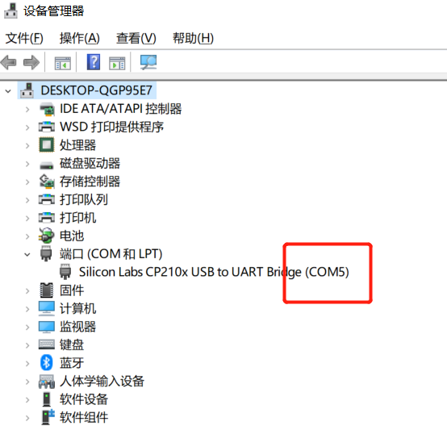
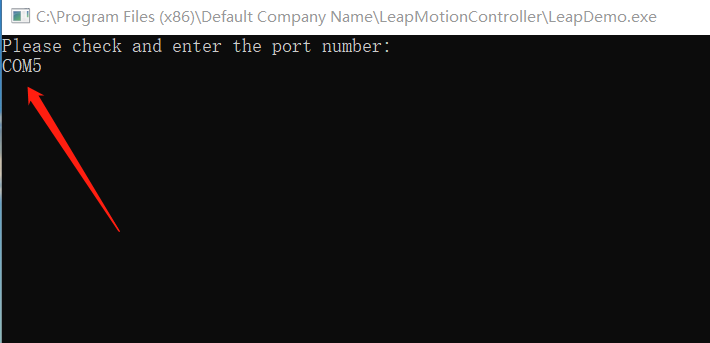

# LeapMotionController
## Install
- Install MyStudio  https://github.com/elephantrobotics/MyStudio/releases
- Download Leapmotion  
    
- install this two file
    
- Burn AtomMain（MyStudio->Basic->AtomMain）into ATOM   
      
  Burn Transponder（MyStudio->Tools->Transponder）into BASIC  
     
## How to use LeapmotionController to control MyCobot  
- check the usb port
    
- enter the port
    
- After LeapmotionController successfully starts, Mycobot will adjusts to initial position automatically 
- Use gestures to control MyCobot to move

### Tips：
1. If you start LeapMotionController and enter port number, it stops on the following page and you cannot control MyCobot through LeapMotion  
      
   Check that the driver has been installed successfully:  
      
   If the driver has been successfully installed but the version is too low, it is recommended to change to the driver provided by us
2. When controlling MyCobot with Leapmotion, Mycobot will return to initial position when the hand is out of range of Leapmotion’s detection
3. MyCobot moves in response to gesture and cannot hover in one position
